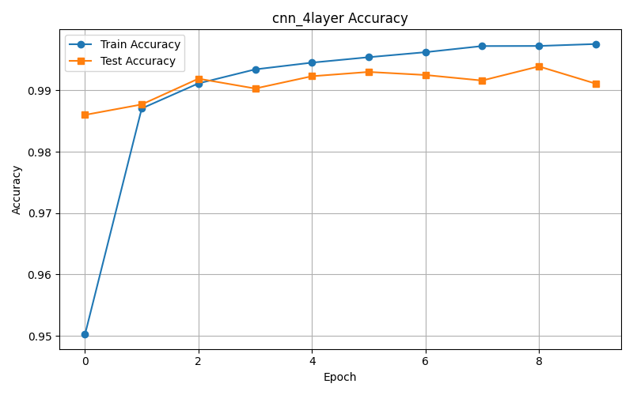

# Отчет

# Задание 1: Сравнение CNN и полносвязных сетей

## 1.1 Сравнение на MNIST

В этом разделе сравнивались три модели на датасете MNIST:  
- Полносвязная сеть (FCNet) с 4 слоями  
- Простая CNN (SimpleCNN) с 2 сверточными слоями  
- CNN с Residual Block (ResidualCNN)  

Для всех моделей использовались одинаковые гиперпараметры.  
Проводилось обучение, оценка точности на обучающем и тестовом множествах, измерялось время обучения и инференса, а также анализировалось количество параметров.

### Архитектуры и параметры моделей

| Модель       | Кол-во параметров | Время обучения (с) | Время инференса (с) | Train Accuracy | Test Accuracy |
|--------------|-------------------|--------------------|---------------------|----------------|---------------|
| FCNet        | 567,434           | 68.46              | 0.001005            | 0.9946         | 0.9810        |
| SimpleCNN    | 421,642           | 74.55              | 0.000000            | 0.9971         | 0.9904        |
| ResidualCNN  | 149,642           | 176.14             | 0.000980            | 0.9908         | 0.9431        |

### Выводы

- SimpleCNN показала наилучшую точность на тесте (99.04%) и хорошее время инференса.  
- FCNet имеет больше параметров, чем SimpleCNN и ResidualCNN, при этом уступает по точности последней.  
- ResidualCNN обучается дольше и уступает по точности, вероятно, из-за сложности архитектуры и меньшего числа параметров.

### Визуализации

  
  
  

## 1.2 Сравнение на CIFAR-10

Сравнивались следующие модели:  
- Глубокая полносвязная сеть (FCNet)  
- CNN с Residual блоками (ResidualCNN)  
- CNN с Residual блоками и регуляризацией (ResidualCNN+Reg)  

Параметры гиперпараметров были одинаковыми для справедливого сравнения.  

### Архитектуры и параметры моделей

| Модель           | Кол-во параметров | Время обучения (с) | Время инференса (с) | Train Accuracy | Test Accuracy |
|------------------|-------------------|--------------------|---------------------|----------------|---------------|
| FCNet            | 3,805,450         | 107.11             | 0.000000            | 0.7527         | 0.5465        |
| ResidualCNN      | 150,794           | 539.23             | 0.001282            | 0.7699         | 0.6750        |
| ResidualCNN+Reg  | 150,794           | 605.60             | 0.001590            | 0.7037         | 0.7306        |

### Анализ

- FCNet переобучается, показывая значительную разницу между тренировочной и тестовой точностью.  
- ResidualCNN лучше обобщается, но при этом требует больше времени на обучение.  
- Добавление регуляризации в ResidualCNN+Reg снижает точность на обучении, но повышает точность на тесте, что свидетельствует об успешном снижении переобучения.

### Визуализации

#### Confusion Matrix

.png)  
.png)  
.png)  

#### Gradient Flow

  
  
  

# Общие выводы

- Для MNIST лучшая точность показала SimpleCNN, при этом она более экономна по параметрам и времени инференса, чем FCNet.  
- Residual блоки в CNN помогают в более сложных задачах (CIFAR-10), особенно с регуляризацией, что снижает переобучение.  
- FCNet на CIFAR-10 переобучается, несмотря на большое число параметров.  
- Время обучения и параметры у CNN с residual блоками гораздо ниже, чем у FCNet на CIFAR-10, что делает их более предпочтительными для подобных задач.

# Задание 2: Анализ архитектур CNN

## 2.1 Влияние размера ядра свёртки

В рамках данного эксперимента были протестированы модели с ядрами свёртки следующих размеров: 3×3, 5×5, 7×7, а также комбинация 1×1 + 3×3. Все модели обучались на датасете MNIST в одинаковых условиях, с одинаковым количеством эпох и фиксированной структурой за исключением размера ядра.

| Архитектура | Точность | Время на эпоху |
|------------|----------|----------------|
| 3×3        | 0.9889   | 14.55s         |
| 5×5        | 0.9917   | 14.62s         |
| 7×7        | 0.9926   | 14.70s         |
| 1×1 + 3×3  | 0.9900   | 14.68s         |

### Kernel 3×3

### Kernel 5×5

### Kernel 7×7

### Kernel 1×1 + 3×3

## 2.2 Влияние глубины сети

Были протестированы модели с различной глубиной: 2, 4 и 6 сверточных слоев, а также ResNet-подход с остаточными связями. Основная цель - оценить, как изменение глубины влияет на точность и стабильность обучения.

| Архитектура | Точность | Время на эпоху |
|------------|----------|----------------|
| 2 слоя     | 0.9900   | 14.54s         |
| 4 слоя     | 0.9911   | 14.79s         |
| 6 слоев    | 0.9889   | 18.88s         |
| ResNet     | 0.9854   | 15.33s         |

### 2 Conv Layers

### 4 Conv Layers

### 6 Conv Layers

### ResNet

## Выводы

- Ядра 5×5 и 7×7 показали наилучшую точность, но чуть более высокое время на эпоху.
- Глубина до 4 слоев положительно влияет на результат, однако увеличение до 6 слоев приводит к переобучению или затуханию градиента.
- ResNet улучшает стабильность градиентов, но не всегда даёт лучшую точность на простых задачах.
- Оптимальный баланс для MNIST: ядро 5×5 и глубина в 4 слоя.

# Задание 3: Кастомные слои и эксперименты

## 3.1 Реализация кастомных слоев

В рамках задания были реализованы кастомные версии сверточного слоя, attention-механизма, функции активации (Swish) и pooling-слоя. Каждый из них протестирован на простых архитектурах, включая прямой и обратный проход. Наилучшие результаты показал Attention-модуль (53.3% точности), а наихудшие - Swish-активация (39.8%). В сравнении с аналогами из PyTorch, кастомные реализации уступают по качеству, но дают ценный опыт понимания внутренней логики работы нейросетей.

### AttentionModule

### CustomPooling

### SwishActivation

## 3.2 Эксперименты с Residual блоками

Были реализованы три варианта Residual блоков: базовый, Bottleneck и Wide. Базовый блок показал наилучшую точность на тесте (89.4%), но уступал Wide блоку по количеству параметров (5034 против 9690). Bottleneck блок, несмотря на наименьшее число параметров (1194), обучался нестабильно и показал низкую точность (51.1%). Эксперименты подтвердили, что ширина и структура остаточных соединений критично влияют на стабильность и эффективность обучения.

### BasicResidualBlock

### BottleneckResidualBlock

### WideResidualBlock

